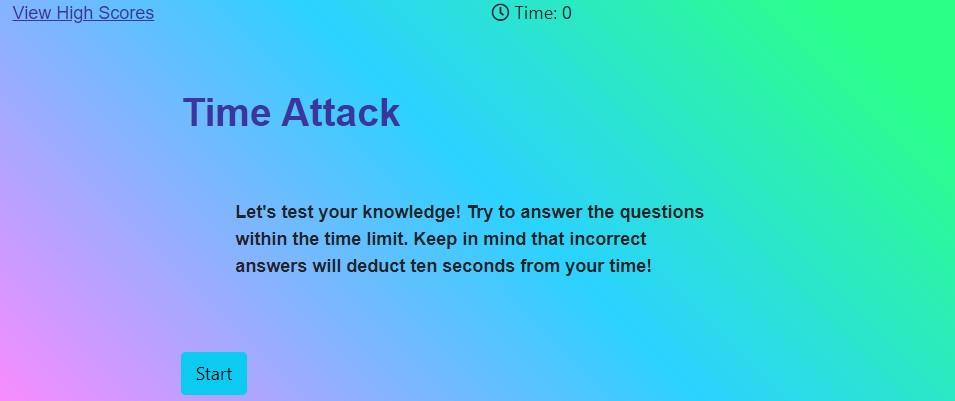

# Timed-Quiz

1. An application that asks user questions about coding, user has limited time to answer the questions given and the quiz is complete when user have answered all question or when timer hits 0.

2. https://chunngaimo.github.io/timed-quiz/

3. 